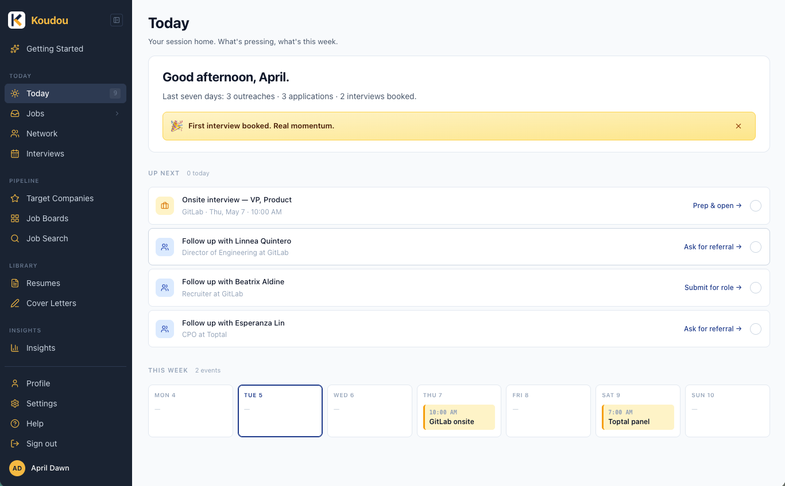
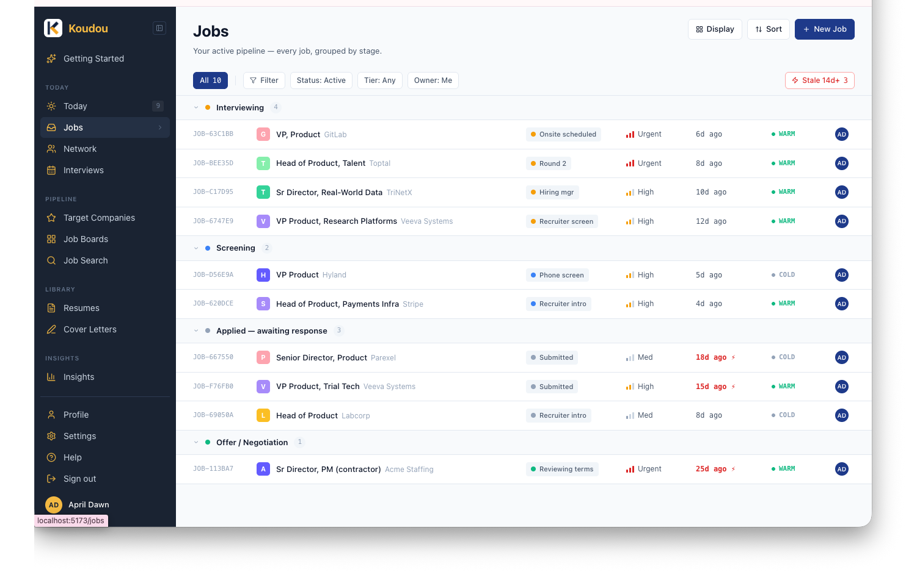
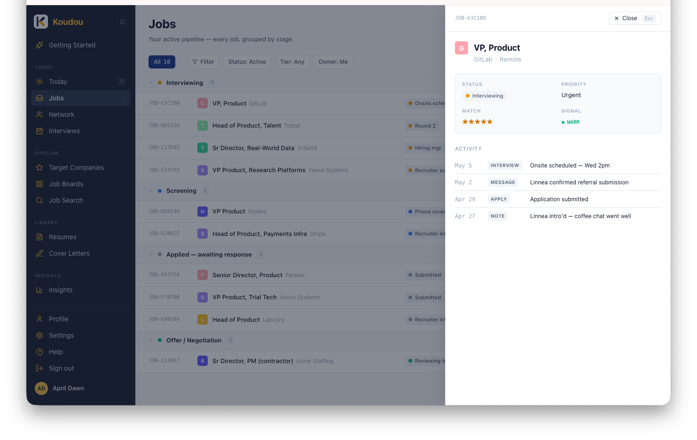
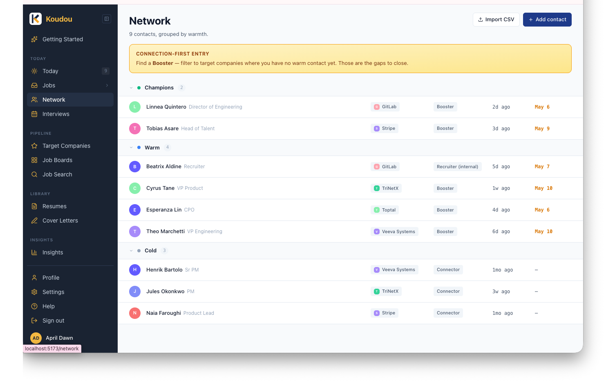
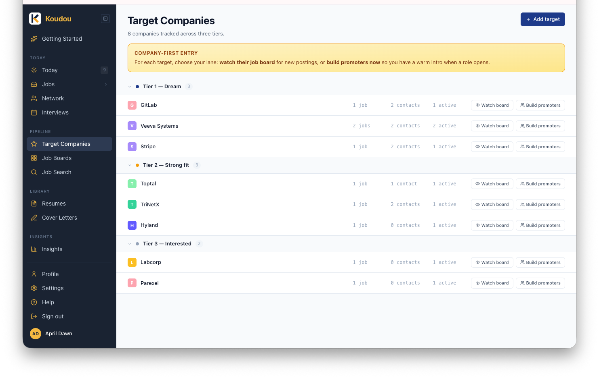
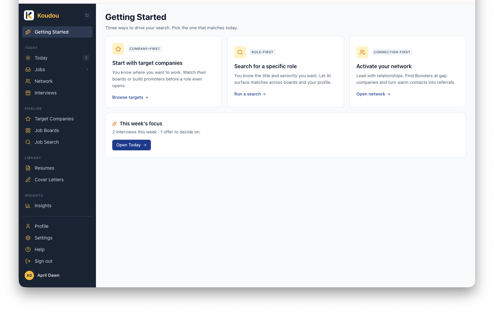
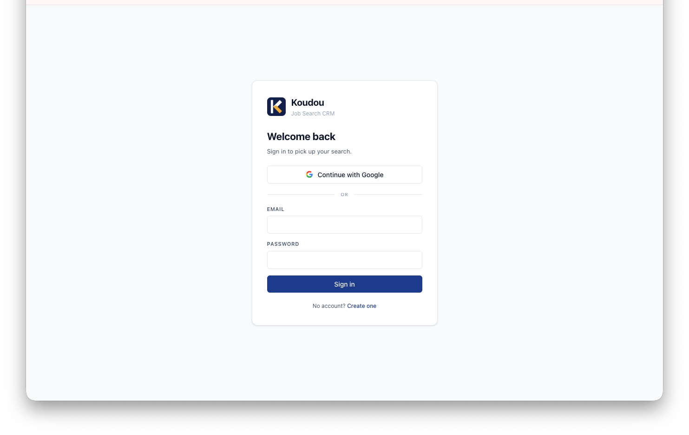

# Koudou

A focused job-search CRM. Built from a static design-handoff prototype (`design_handoff_koudou`, currently private).

## What it looks like



<details>
<summary>More views</summary>

**Jobs** — status-grouped pipeline (interview / screening / applied / offer)



**Job detail panel** — slide-in with status, priority, match score, and activity timeline



**Network** — contacts grouped by warmth (Champions / Warm / Cold)



**Target Companies** — three tiers with per-row aggregates (jobs tracked, contacts, active apps)



**Getting Started** — entry-point chooser with adaptive "this week's focus" callout



**Sign in** — email/password or Google OAuth via Supabase



</details>

> Screenshots are populated from `supabase/seed.sql`. Names are deliberately fictional.

## Demo

A private demo runs at **https://koudou.pages.dev/**. Sign-in is invite-only via a shared code; email April for access. See [`DEMO.md`](DEMO.md) for the full flow, what gets seeded, and how to host your own.

> **Heads-up:** AI Job Search currently returns AI-generated *suggestions*, not real postings. Real-web-search foundation is being rebuilt — a Lovable feature regression we caught during design review. Cover Letters, Skill Gap, and Weekly Plan all work as expected.

## Stack

- **Build:** Vite + TypeScript
- **UI:** React 19 + Tailwind CSS v4 + shadcn/ui (Radix primitives)
- **Routing:** React Router 7
- **State:** TanStack Query (server) + Zustand (UI)
- **Backend:** Supabase (Postgres + Auth + Storage)
- **Package mgr:** pnpm
- **Node:** ≥20

## Lineage

Koudou was first built on Lovable, where iteration on the JTBD framework, the
design system, and the product direction happened. After that build accumulated
UX cruft, the surface area was redesigned in Claude Design — the static
prototype lives in a sibling `design_handoff_koudou` repo (currently private) —
and ported here as a clean Vite + React + Supabase rebuild.

The Lovable predecessor is preserved as a private archive: frozen, read-only,
retained as a historical record. This codebase is the active line.

## Quick start

```bash
pnpm install
cp .env.example .env   # then fill in your Supabase values
pnpm dev
```

The dev server runs on http://localhost:5173.

## Forking? Stand up your own backend

This repo intentionally ships **zero credentials**. `.env` is gitignored, and any
secrets in screenshots/docs are illustrative. To run your own copy you'll set up
your own Supabase project + your own Google OAuth client (~15 minutes total).

### 1 · Supabase project

1. Create a free Supabase project at https://supabase.com/dashboard.
2. **Settings → API** → copy these into `koudou/.env`:
   ```env
   VITE_SUPABASE_URL="https://<your-project>.supabase.co"
   VITE_SUPABASE_ANON_KEY="<your publishable / anon key>"
   ```
3. **SQL Editor** → paste and run `supabase/migrations/20260504_initial_schema.sql`,
   then `supabase/migrations/20260504_grants.sql`. Both are idempotent.
4. **Authentication → URL Configuration → Redirect URLs** → add `http://localhost:5173/**`.

### 2 · Google OAuth (for "Continue with Google")

1. **Google Cloud Console** → create a new project (any name; "No organization"
   is fine for personal Google accounts).
2. **APIs & Services → OAuth consent screen** (or **Google Auth Platform → Branding**
   in the newer UI):
   - Audience: **External**
   - App name: anything (`Koudou` is fine)
   - User support + developer contact emails: your email
   - Save. Don't publish — keep it in **Testing** mode.
3. **Audience → Test users** → add your email (only listed test users can sign in).
4. **Credentials → Create credentials → OAuth client ID**:
   - Application type: **Web application**
   - Authorized JavaScript origins:
     - `http://localhost:5173`
     - `https://<your-project>.supabase.co`
   - Authorized redirect URIs:
     - `https://<your-project>.supabase.co/auth/v1/callback`
   - Copy the resulting **Client ID** and **Client Secret**.
5. **Supabase → Authentication → Providers → Google**:
   - Toggle **Enable Sign in with Google** on.
   - Paste Client ID + Client Secret. Save.

### 3 · Run

```bash
pnpm install && pnpm dev
```

Hit http://localhost:5173/auth, click **Continue with Google**. You'll see Google's
"unverified app" warning — that's expected for a personal/self-hosted instance.
Approve, and you'll land in the app. RLS policies in the schema scope every table
to `user_id = auth.uid()`, so each forker only ever sees their own data.

## Project shape

```
src/
├── components/
│   ├── AppLayout.tsx     ← sidebar + main outlet
│   ├── Sidebar.tsx       ← IA: Today / Pipeline / Library / Insights
│   └── PageStub.tsx      ← placeholder used by all v1 stub pages
├── integrations/
│   └── supabase/
│       ├── client.ts     ← typed client, reads VITE_SUPABASE_*
│       └── types.ts      ← regenerate with `supabase gen types`
├── lib/
│   └── utils.ts          ← cn() helper
├── pages/                ← one file per route
├── App.tsx               ← <Routes>
├── main.tsx              ← <BrowserRouter> + QueryClient
└── index.css             ← design tokens (source of truth) + Tailwind theme
```

## Routes

| Path               | Page             | Status (Session 1)        |
| ------------------ | ---------------- | ------------------------- |
| `/auth`            | Sign in / sign up | ✅ Wired to Supabase     |
| `/getting-started` | Entry-point chooser | ⏳ Stub                |
| `/today`           | Session home     | ⏳ Stub                   |
| `/jobs`            | Pipeline         | ⏳ Stub (Session 2)       |
| `/network`         | Contacts by warmth | ⏳ Stub (Session 4)     |
| `/interviews`      | Interview calendar | ⏳ Stub                 |
| `/targets`         | Target Companies | ⏳ Stub (Session 4)       |
| `/boards`          | Job Boards       | ⏳ Stub (Session 6)       |
| `/search`          | AI Job Search    | ⏳ Stub (Session 5)       |
| `/resumes`         | Resume library   | ⏳ Stub                   |
| `/letters`         | Cover Letters    | ⏳ Stub (Session 5)       |
| `/insights`        | Recap / Funnel / Skills | ⏳ Stub (Session 6) |
| `/profile`         | Search profile   | ⏳ Stub                   |
| `/settings`        | Account + integrations | ⏳ Stub             |
| `/help`            | Docs + shortcuts | ⏳ Stub                   |

## Design tokens

The CSS variables in `src/index.css` are the source of truth, ported directly from
`design_handoff_koudou/src/styles.css`. They're exposed to Tailwind via `@theme inline`
so utility classes like `bg-side-bg`, `text-brand-strong`, `border-line`, `text-ink-muted`
all resolve to the prototype's exact values.

When the prototype CSS and this codebase disagree, the prototype wins — re-port the token.

## License

[PolyForm Noncommercial 1.0.0](./LICENSE) — free for noncommercial use; contact the
author for commercial licensing. See [NOTICE.md](./NOTICE.md).

## Roadmap

Sessions are scoped tight in `../design_handoff_koudou/README.md`:

1. ✅ **Session 1** — Scaffold + sidebar shell + auth route
2. ✅ **Session 2** — Schema + Pipeline (Jobs) view + DetailPanel + Google OAuth
3. ✅ **Session 3** — Today view + actionEngine port
4. ✅ **Session 4** — Network + Target Companies + Getting Started + brand marks
5. **Session 5** — AI features (Job Search → Cover Letters → Skill Gap)
6. **Session 6** — Insights + Job Boards + Library polish
7. **Session 7** — Command palette, polish, deploy
